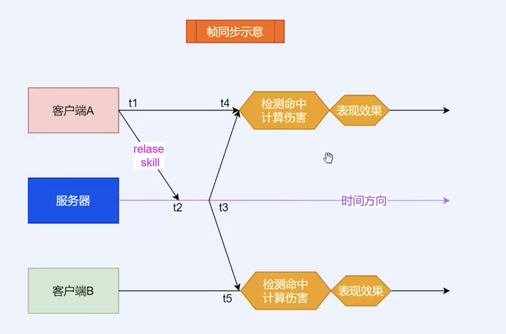

### Unity
* 关闭场景天空盒
  * Windows -> Rendering -> Lighting -> Environment -> Skybox Material -> None
* 导入美术资源
  * Assets -> 右键 -> Import Package -> Custom Package...

### 帧同步实时对战 Moba 游戏技术难点重点
* 同步: 在不同的客户端当中表现相同
#### 关于帧同步
* 网络同步
  * 帧同步与状态同步的差异, 两种同步方式的优劣
  * 选用帧同步需要确保不同平台运算结果一致
* 定点数运算
  * 什么是定点数?
* 确定性物理碰撞
  * 不能使用 Unity 引擎自带物理系统
#### 关于实时对战
* 高频率的网络通信
  * TCP 协议无法满足需求, 必须实现可靠的 UDP 通信
* 逻辑与显示分离
  * 逻辑运算不依赖与 Unity 引擎
* 运动行为预测与插值平滑
  * 逻辑层帧速率不能直接用于显示层变现
#### 关于 Moba 游戏
* 复杂的技能设计
  * 施放方式有多种多样, 作用目标可随机变化, 命中效果是五花八门
* 复杂的 Buff/Debuff 及各类状态
#### 帧同步示意
两个角色1V1对战, A客户端释放技能(给命中的敌人造成50点伤害):
* 帧同步: A将释放技能的操作请求发送到服务器, 服务器广播该操作请求到所有的客户端, 
这些客户端收到该请求后让 A 角色释放技能并检测命中计算伤害表现效果(在各自的客户端当中进行计算)

* 状态同步: 